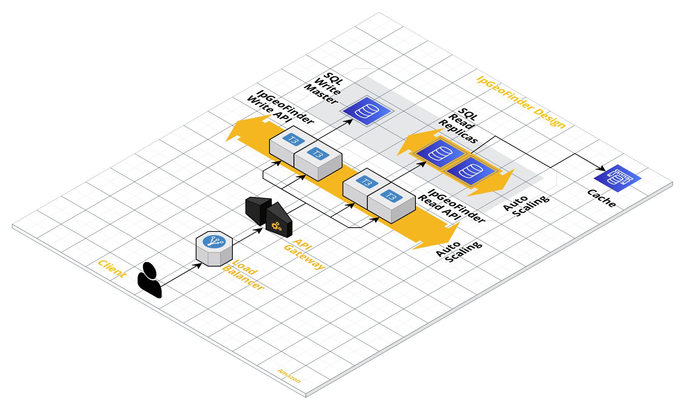
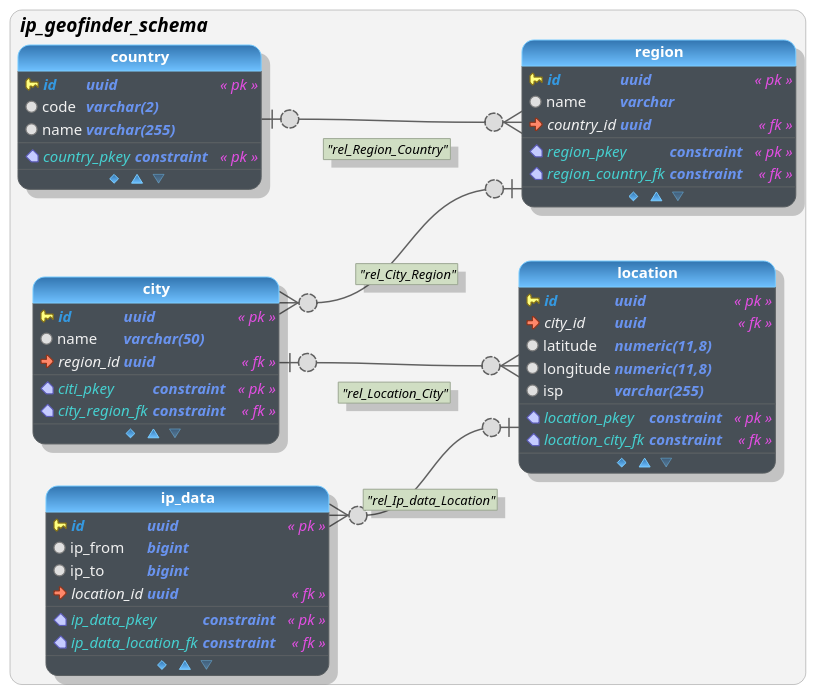
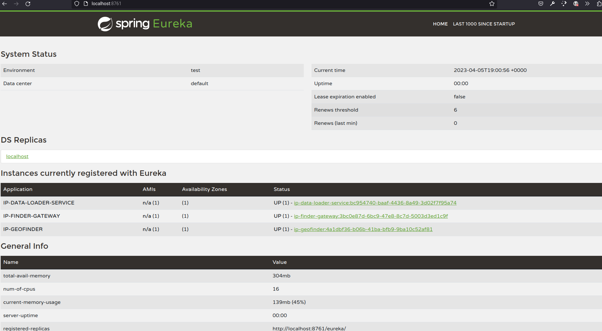

# Ip Geo Finder

This project use a microservice architecture similar to this: 



Where is used a Load Balancer and API Gateway for handle the load and routing to the different microservices, were creaetd two different microservices one for the Write operations as load the IP data to the database and other microservice for Read Operations, the idea is that the microservices aid to different databases, handle a master database for write operations and replicas for read operations and handle a cache for read operations too.

Where you can find the next projects:

* **ipGeoFinderGateway:** This is the gateway
* **ipGeoFinderDiscovery:** This is the discovery server with Eureka
* **ipgeofinder:** This microservice load the data from a csv file
* **ipGeofinderQuery:** This microservice expose the query for information about an Ip address


## Database Design

The design for the persistence layer is similar to this one



## Build

You can build each microservice, gateway and discovery with this command within root of each project:

```
./gradlew -Pprod clean bootJar
```

or run the following command for build all services:

```agsl
./gradlew -Pprod :ipGeofinderDiscovery:clean :ipGeofinderGateway:clean :ipGeofinderLoad:clean :ipGeofinderQuery:clean bootJar
```

## Run

For run your project, you can use all services and gateway with the next command within folder `/docker-compose`

```
docker-compose up ipGeofinderLoad ipGeofinderQuery ipGeofinderDiscovery ipGeofinderGateway
```

You can verify that all services are runing with the discovery tool in this endpoint: `http://localhost:8761`

## Discovery

This project use Eureka like server of discovery and you can see the status of each service similar to this:




## The Continuous Integration process for building the application:

Version control: Use a version control system like Git to store source code and track revisions.

Also a version control for the database with liquibase

Build Automation: Use tools like Gradle to automate the build of your application. This way, whenever a change is made to the source code, the build process will start automatically.

Automatic tests: Implement unit and integration tests to ensure that the application works correctly. Tests should run automatically on every build.

Static code analysis: Use static code analysis tools like SonarQube to identify potential problems in the source code and ensure programming best practices are followed.

Continuous Deployment: Use tools like Jenkins or Travis CI to automate the deployment process in a test environment, ensuring that the compiled version is deployed without problems.

Monitoring and feedback: Use monitoring tools to identify errors in the application and feed the results back to developers so they can fix problems as soon as possible.
